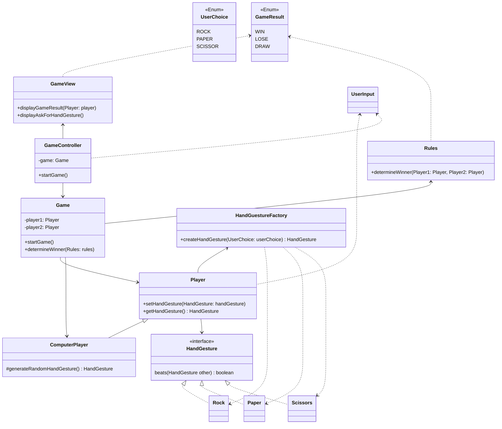

```mermaid 
classDiagram
class HandGesture {
  <<interface>>
  beats(HandGesture other) boolean
}

class Rock {
 
}

class Paper {
 
}

class Scissors {
 
}

HandGesture <|.. Rock
HandGesture <|.. Paper
HandGesture <|.. Scissors

class Player {
  +setHandGesture(HandGesture: handGesture)
  +getHandGesture() HandGesture
}

class ComputerPlayer {
  #generateRandomHandGesture() HandGesture
}

Player <|-- ComputerPlayer
Player --> HandGesture

class Game {
  -player1: Player
  -player2: Player
  +startGame()
  +determineWinner(Rules: rules)
}

Game --> Player
Game --> ComputerPlayer

class Rules {
  +determineWinner(Player1: Player, Player2: Player)
}

Rules <-- Game

class GameController {
  -game: Game
  +startGame()
}

GameController --> Game

class GameView {
  +displayGameResult(Player: player)
  +displayAskForHandGesture()
}

GameView <-- GameController

class UserChoice {
  <<Enum>>
  ROCK
  PAPER
  SCISSOR
}

UserInput <.. Player
UserInput <.. GameController

class GameResult {
  <<Enum>>
  WIN
  LOSE
  DRAW
}

GameResult <.. GameView
GameResult <.. Rules

class HandGuestureFactory {
  +createHandGesture(UserChoice: userChoice) HandGesture
}

HandGuestureFactory <-- Player
HandGuestureFactory ..> Rock
HandGuestureFactory ..> Paper
HandGuestureFactory ..> Scissors
```